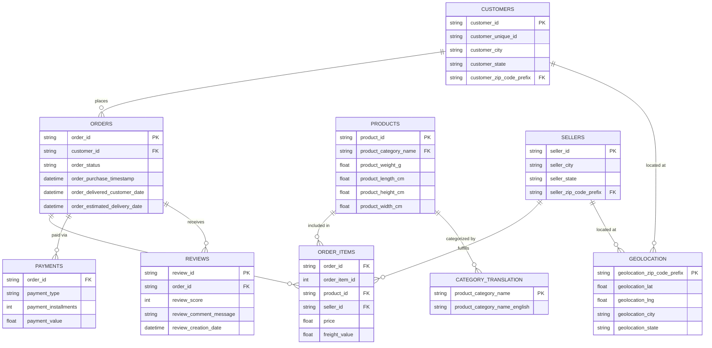

# Customer Intelligence Platform for E-commerce

An end-to-end data science project that turns raw e-commerce data into strategic business insight — built on the Olist Brazilian E-commerce dataset, and designed to mirror how analytics teams actually operate inside real online retail companies.

---

## Table of Contents

- [Overview](#overview)
- [Problem Statement](#problem-statement)
- [Objectives](#objectives)
- [Project Scope](#project-scope)
- [Dataset Overview: Olist Brazilian E-commerce](#dataset-overview-olist-brazilian-e-commerce)
- [Entity-Relationship Diagram](#entity-relationship-diagram)
- [Functional Requirements](#functional-requirements)
- [Proposed Features](#proposed-features)
- [Technology Stack](#technology-stack)
- [Methodology](#methodology)
- [Expected Outcomes](#expected-outcomes)
- [Future Enhancements](#future-enhancements)
- [Recommended Documentation Structure](#recommended-documentation-structure)
- [Conclusion](#conclusion)

---

## Overview

E-commerce businesses generate enormous volumes of customer, transaction, product, and review data every day — yet most of that data never gets turned into anything actionable. Decisions around retention, marketing, inventory, and forecasting are still frequently made on gut feeling or partial reporting rather than solid evidence.

This project sets out to close that gap. It uses the publicly available **Olist Brazilian E-commerce Dataset** to build a complete, production-style analytics platform — one that stitches together data engineering, statistics, machine learning, visualization, and deployment into a single working system, rather than a one-off notebook or a single predictive model.

Instead of solving just one problem, the platform tackles several interconnected business questions at once: who are our best customers, who's about to churn, how much is each customer worth over time, what will sales look like next quarter, and what should we recommend to whom. The end goal is twofold — to simulate how a data science function operates inside a modern e-commerce company, and to produce a portfolio-grade project that reflects genuine industry practice.

---

## Problem Statement

Most e-commerce companies are sitting on more data than they know what to do with, but lack the analytical infrastructure to make sense of it. That creates real, recurring business problems:

- Difficulty identifying which customers are actually valuable
- No early warning system for customer attrition (churn)
- Limited understanding of purchasing behavior and patterns
- Inaccurate or absent forecasts of future revenue
- Weak or non-existent product recommendation capabilities
- Strategic decisions made without solid predictive backing

Traditional reporting tools are good at telling you what already happened — they're far less useful at telling you what's likely to happen next. Without predictive capability, companies end up reacting to customer loss and missed revenue instead of preventing it.

This project addresses that gap directly by building an integrated platform that combines data engineering, machine learning, and business analytics into one coherent decision-support system.

---

## Objectives

The core goal is to design and build an end-to-end Customer Intelligence Platform that converts raw e-commerce data into actionable insight using modern data science methods.

More specifically, the project aims to:

1. Design a relational database around the Olist dataset
2. Perform thorough data cleaning and preprocessing
3. Run exploratory data analysis to understand purchasing behavior
4. Engineer meaningful features across multiple relational tables
5. Segment customers based on their purchasing patterns
6. Predict customer churn using machine learning
7. Estimate Customer Lifetime Value (CLV)
8. Forecast future sales trends
9. Build a product recommendation system
10. Explain model predictions using Explainable AI (XAI)
11. Deliver interactive dashboards for business users
12. Deploy trained models through REST APIs
13. Implement experiment tracking and model monitoring
14. Demonstrate a full, production-level data science workflow

---

## Project Scope

**In scope:**

- Data acquisition and storage
- Relational database design
- SQL-based data extraction
- Data cleaning and preprocessing
- Exploratory Data Analysis (EDA)
- Statistical analysis
- Feature engineering
- Machine learning model development and evaluation
- Explainable AI
- Interactive dashboard development
- API deployment
- Experiment tracking
- Containerization
- Documentation

**Out of scope:**

- Live/real-time transaction processing
- Real-time recommendation serving

This is a historical-data project by design — the dataset is static, so the focus stays on batch analytics and predictive modeling rather than streaming infrastructure.

---

## Dataset Overview: Olist Brazilian E-commerce

The platform is built entirely on the **Olist Brazilian E-commerce Public Dataset**, a real, anonymized dataset released by Olist — a Brazilian marketplace that connects small businesses to major online retail channels. It covers roughly **100,000 orders** placed between **2016 and 2018** across multiple marketplaces in Brazil, and is one of the most widely used open datasets for e-commerce analytics because of how closely it mirrors real production data: it's relational, it's messy in places, and it spans the full order lifecycle rather than just a single flat table.

The dataset is split across nine interconnected tables:

| Table | Description |
|---|---|
| **Customers** | Customer demographic and location information |
| **Orders** | Order status and timestamps across the order lifecycle |
| **Order Items** | Individual products included within each order |
| **Products** | Product attributes and category information |
| **Sellers** | Seller identity and location information |
| **Payments** | Payment methods and transaction values |
| **Reviews** | Customer ratings and written review comments |
| **Geolocation** | Geographic coordinates for customers and sellers |
| **Category Translation** | Maps Portuguese product categories to English |

Because these tables are relational rather than pre-aggregated, the dataset supports genuinely complex, multi-table business analysis — similar to what you'd encounter working against a real production database, rather than a single tidy CSV.

---

## Entity-Relationship Diagram

The diagram below shows how the nine Olist tables relate to one another. `customers` and `sellers` sit at the edges of the model, `orders` acts as the central hub, and `order_items` is the bridge table connecting orders to both products and sellers.

## Functional Requirements

The platform should be able to:

- Import relational datasets into PostgreSQL
- Perform automated data cleaning
- Generate exploratory analysis reports
- Engineer customer-level features
- Build and compare multiple machine learning models
- Evaluate model performance against relevant metrics
- Explain predictions using SHAP
- Serve interactive dashboards to business users
- Predict customer behavior through an API
- Export analytical reports

---

## Proposed Features

**Customer Analytics**
- Customer profiling
- Purchase behavior analysis
- Geographic analysis
- Spending analysis

**Customer Segmentation**
- RFM (Recency, Frequency, Monetary) analysis
- K-Means clustering
- Customer persona generation

**Churn Prediction**
- Churn probability scoring
- Risk categorization
- Retention recommendations

**Customer Lifetime Value (CLV)**
- CLV estimation
- High-value customer identification
- Revenue contribution analysis

**Sales Analytics**
- Monthly sales trends
- Product performance analysis
- Seasonal analysis
- Revenue forecasting

**Recommendation Engine**
- Similar product recommendations
- Frequently-bought-together analysis
- Personalized recommendations

**Explainable AI**
- SHAP-based analysis
- Feature importance ranking
- Prediction-level explanations

**Business Dashboard**
- KPI tracking
- Interactive charts
- Customer insights
- Sales insights
- Live prediction interface

---

## Technology Stack

| Component | Technology |
|---|---|
| Programming Language | Python |
| Database | PostgreSQL |
| SQL | PostgreSQL |
| Data Processing | Pandas, NumPy |
| Visualization | Matplotlib, Plotly |
| Machine Learning | Scikit-learn |
| Gradient Boosting | XGBoost, LightGBM |
| Explainability | SHAP |
| Experiment Tracking | MLflow |
| API | FastAPI |
| Dashboard | Streamlit |
| Containerization | Docker |
| Version Control | Git & GitHub |

---

## Methodology

The project follows **CRISP-DM** (Cross-Industry Standard Process for Data Mining), the industry-standard framework for structuring data science work:

1. **Business Understanding** — Define business objectives and pin down the key analytical problems
2. **Data Understanding** — Explore the dataset, map relationships between tables, and assess data quality
3. **Data Preparation** — Clean the data, handle missing values, merge relational tables, and engineer features
4. **Exploratory Data Analysis** — Study customer behavior, sales patterns, payment preferences, and product performance
5. **Model Development** — Build and compare models across classification, regression, clustering, recommendation, and forecasting tasks
6. **Model Evaluation** — Assess models using metrics such as F1-score, ROC-AUC, RMSE, MAE, Silhouette Score, and business-oriented KPIs
7. **Explainability** — Interpret predictions using SHAP values and feature importance
8. **Deployment** — Serve trained models via REST APIs and expose them through an interactive dashboard
9. **Monitoring & Maintenance** — Track experiments, monitor performance over time, detect data drift, and support retraining

---

## Expected Outcomes

By the end of this project, the platform should be able to:

- Identify high-value customer segments
- Flag customers at risk of churning
- Estimate customer lifetime value
- Forecast future sales
- Recommend relevant products
- Present findings through business-friendly dashboards
- Deliver explainable, trustworthy predictions
- Demonstrate a genuinely production-ready data science workflow

---

## Future Enhancements

- Real-time streaming analytics
- Deep learning–based recommendation systems
- LLM integration for natural-language business insights
- Customer support chatbot
- Cloud-native deployment
- Automated model retraining pipelines
- MLOps integration with Kubernetes
- Multi-language dashboard support

---

## Recommended Documentation Structure

To keep this feeling like a real software product rather than a one-off ML experiment, maintain a `docs/` directory alongside the code containing:

- Project Proposal
- Software Requirements Specification (SRS)
- Database Design
- Data Dictionary
- Feature Engineering Guide
- Model Evaluation Report
- API Documentation
- Deployment Guide

Keeping these documents current alongside the codebase not only keeps the project organized — it's also what makes it stand out to employers and graduate admissions committees.

---

## Conclusion

The Customer Intelligence Platform for E-commerce is meant to be a full, realistic demonstration of what modern data science looks like inside an e-commerce business — from raw relational data all the way through to deployed, explainable, monitored models. By tying together data engineering, EDA, machine learning, visualization, explainability, and deployment in one place, it captures the complete lifecycle of an industrial-grade data science solution.

Beyond the models themselves, the platform is built to create real business value: helping teams understand their customers better, sharpen marketing strategy, improve retention, quantify long-term customer value, and make decisions backed by evidence rather than guesswork. As a portfolio piece, it also demonstrates hands-on proficiency across SQL, statistics, feature engineering, machine learning, API development, and production-oriented engineering practice.
