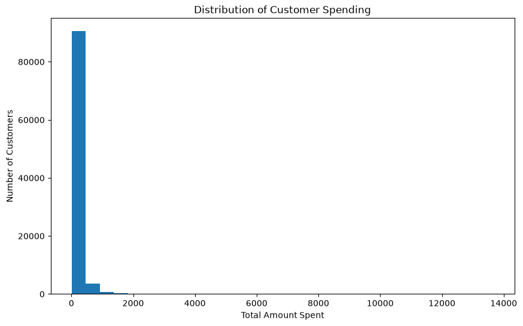

### Customer total Spending distribution

Customer spending is highly concentrated. While the majority of customers make relatively small purchases, a small segment of high-value customers contributes disproportionately large transaction amounts. These premium customers represent an important opportunity for retention strategies, personalized recommendations, and loyalty programs.

### Customer Purchase Frequency

The distribution of customer orders is extremely concentrated around a single purchase. Approximately **96.95%** of customers placed only one order during the observation period, while only a small proportion made repeat purchases.

The variable exhibits an **extremely right-skewed distribution** (skewness = **11.44**), indicating that a few customers placed multiple orders, with the maximum reaching **16 orders**. Since the first, second, and third quartiles are all equal to one, nearly all repeat purchasers appear as statistical outliers under the IQR method. These observations represent genuine customer behavior and were therefore retained.

From a business perspective, the results suggest that the marketplace relies heavily on one-time purchasers, highlighting an opportunity to improve customer retention through loyalty programs, personalized recommendations, and repeat purchase campaigns.

### Average Order Value Distribution

The average order value exhibits a highly right-skewed distribution (skewness = **9.28**), indicating that while most customers place relatively low-value orders, a small number make exceptionally large purchases. The median order value is **105.78**, whereas the mean is substantially higher at **161.07**, reflecting the influence of high-spending customers.

Approximately **90%** of customers have an average order value below **307.94**, while only the top **1%** exceed **1,069**, highlighting a small premium customer segment that contributes disproportionately to marketplace revenue.

The distribution closely resembles that of total customer spending because nearly **97%** of customers placed only a single order during the observation period. Consequently, for most customers, average order value is effectively equal to total spending. This insight emphasizes the importance of increasing purchase frequency alongside average order value to drive sustainable revenue growth.

### Average Review Score Distribution

Customer review scores exhibit a **negatively skewed distribution** (skewness = **-1.39**), indicating that ratings are heavily concentrated toward the maximum value of **5**. The median and mode are both **5**, while the mean is slightly lower at **4.10**, reflecting the influence of a relatively small number of low ratings.

The percentile analysis shows that at least **50%** of customers have an average review score of **5**, and even the 75th, 90th, 95th, and 99th percentiles remain at the maximum rating. This demonstrates consistently high customer satisfaction across the marketplace.

From a business perspective, the results suggest that most customers are satisfied with their overall shopping experience. Although low ratings are comparatively uncommon, they remain valuable indicators of potential issues related to product quality, delivery performance, or seller service, making review scores an important feature for customer retention and predictive modeling.

### Average Delivery Days Distribution

The average delivery time exhibits a **strongly positively skewed distribution** (skewness = **3.88**), indicating that while most customers receive their orders within a relatively short period, a small number experience substantially longer delivery times. The median delivery time is **10 days**, whereas the mean is **12.51 days**, reflecting the influence of these delayed deliveries.

The most common delivery duration is **7 days**, suggesting that one-week delivery is the standard customer experience. Percentile analysis shows that **75%** of customers receive their orders within **16 days**, **90%** within **23 days**, and **99%** within **46 days**.

Although a few customers experienced exceptionally long delivery times, reaching up to **210 days**, these records represent genuine business events and were retained for analysis. Overall, the results indicate that delivery performance is satisfactory for most customers, while a relatively small number of extreme delays present opportunities for logistics optimization and improved customer satisfaction.